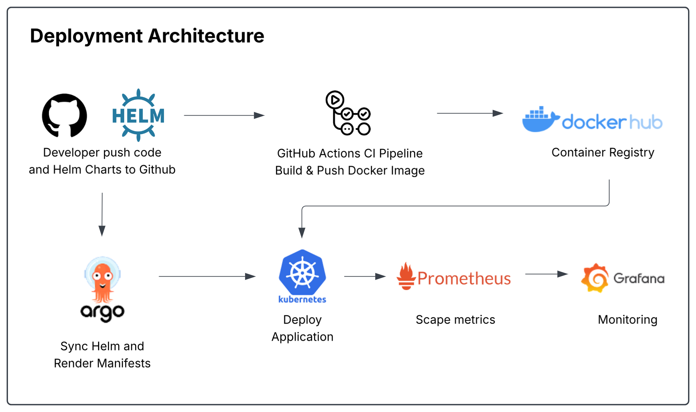
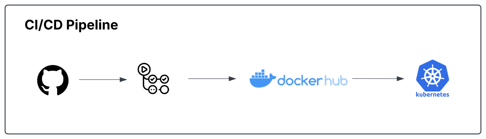
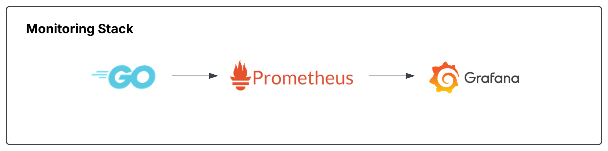
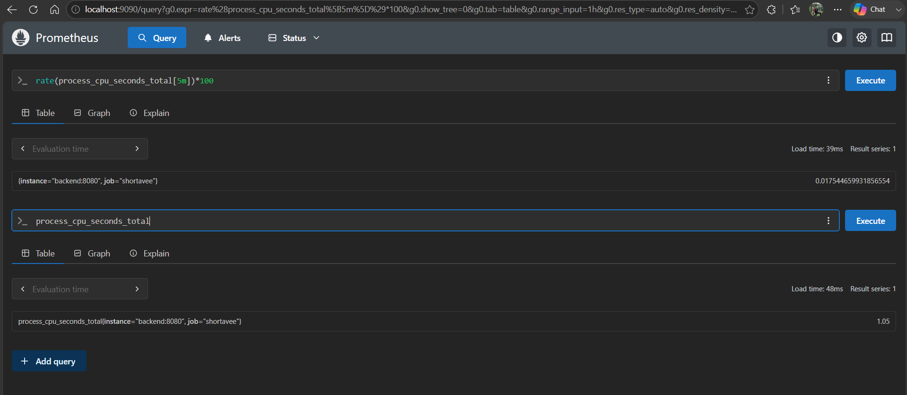
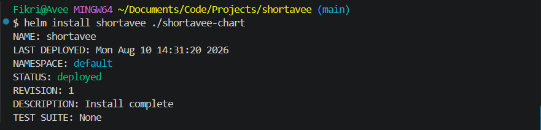
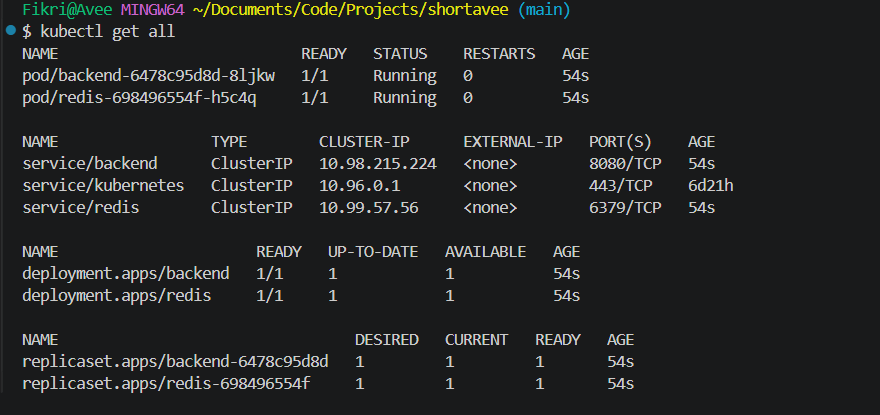
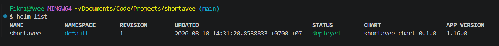
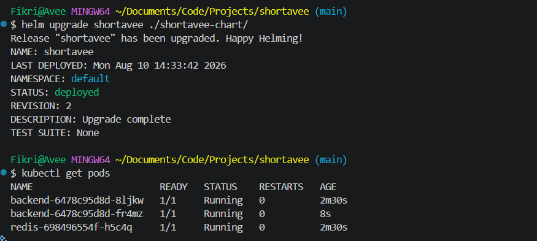
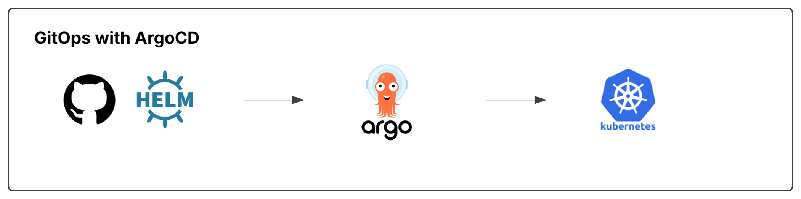
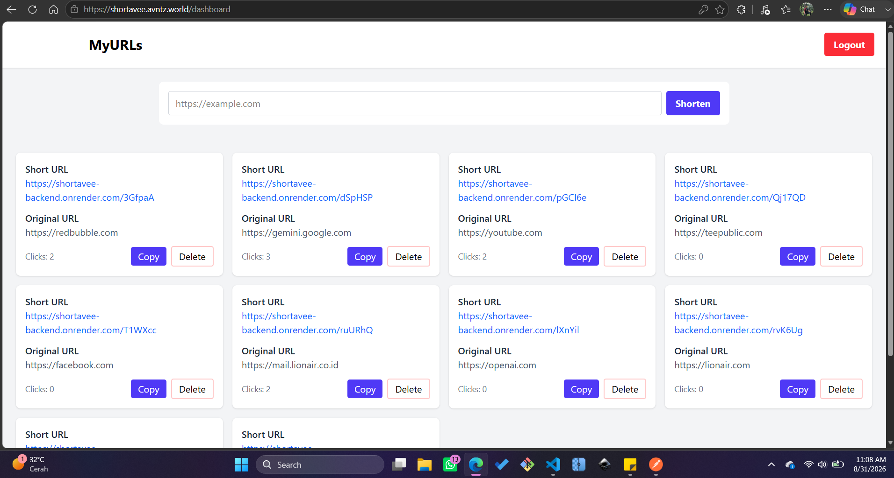

# Shortavee
A modern URL Shortener built with **Go (Gin)**, **PostgreSQL**, and **Redis**, designed with a cloud-native architecture and deployed using **Docker**, **Kubernetes**, **Helm**, and **ArgoCD**.
<br>

<!-- ### Backend progress:
In this project our Golang workflow is using
- router: maps endpoints into a function/handler. Using Gin (a high-performance HTTP web framework)
- handler: accepts and validates the request and giving respond to the user.
- services: the logic and decision-making. Generate a short code for the URL using the UUID (Universally Unique ID) library from Google.
- repository: communicates with the database using the GORM library (Golang object-relational Mapping).
<br>
In this project, so far, we have 2 endpoints

- /api/shorten: POST request to shorten a URL
- /api/urls: GET request to show all URLs and its informations.

<br>
Now we get 2 more backend endpoints

- api/register: POST request using JSON header email and password. The algorithm: get email and password, check whether they exist or not in the database, if it does, return error: email already exists!. If it's not, hash the password and save it in the DB.
- api/login: POST request needs a JSON header as well, but returns a JWT token. The algorithm: Find email in DB, if it's found, check the password to see if it's correct or not. If it's correct, return a token.

### Now we are using JWT Authentication, 
which is a token-based auth. So once we log in, we get a token that will be used to access shorten and URL endpoints. The token is stored in the browser LocalStorage, valid for 24 hours, and used to make authenticated actions.

### React progress;
- Now we have a login page and a dashboard + a logout button
- Unauthenticated user can not access dashboard, so once user will be directed to main path once they access dashboard enpoint. How does this work? react read whether the user has a token or not in localStorage. If they do not have a token, they will be redirected to "/". 
- The lack of this concept, React will only see whether it has the token or not, and doesn't care whether the token is right or not.
- Now the dashboard has shown URLs generated by the user.

    


### Logout
Logout algorithm is simple, (for now) we just delete the token in localStorage, then navigate the user to the login path

### Update 27 June 2026
- Added URL shortener form and copy button.

  
<br>

### Update 27 June 2026.2
- A few hours later, I completed better dashboard page with better UI using tailwindcss, and add delete endpoint
- It works by finding the url id and match the userID. If those parameters match, then execute the deletion. Once the button clicked, it calls delete function that connected to backend api

  

### Update 29 June 2026
- Tidy up card order (responsive) and it's component (reposition copy and delete button)
- Update delete function, when the URL deleted, it immediately update the URL list by adding local state. Also replace window delete confirmation using sweetalert
- Using toast for alert succes, and error

### Update 2nd July 2026
- Make better UI for login and register page.
  <br>

  

### Update 6th of July 2026
- Sucessfully deployed
- Frontend in Vercel
- Backend in Render
- Database in Neon
- Build filters on Render and Vercel

### Update 7th of July
- Successfully dockerized backend and frontend into images.
- But now still running both services separately
- docker run -p 5173:5173 shortavee-frontend
- docker run --env-file .env -p 8080:8080 shortavee-backend
- docker compose up -d --build
- docker compose up -d (running two services automatically)
<br>
<br>

---

### **Update 25th of August**
  **What I have completed per 25th of August:**
  
  - Implement Github Actions that consist of 2 workflows
    <br>

    
    <br>

    CI Pipeline builds backend and frontend images
    <br>
    
    

    Docker-build builds backend and push it to docker hub.
    <br>

    
    
    Image pushed to docker hub
    <br>

    

<br>
<br>

---

### **🖥️Monitoring and Observability📊**
  **Prometheus**\
  Collect and store numeric performance metrics as time-series data.

  ```
  global:
    scrape_interval: 15s

  scrape_configs:
    - job_name: "shortavee"

      static_configs:
        - targets:
            - backend:8080
  ```
  In this project I create simple script to collect data in backend service with job name shortavee in every 15 seconds. 
  
  **Grafana** -->

## Overview

Shortavee is a URL shortening platform that allows users to create and manage shortened URLs securely. The project was developed as a hands-on learning journey covering backend development, containerization, CI/CD, observability, Kubernetes, and GitOps practices.

### Key Features

- User Authentication with JWT
- URL Shortening
- URL Redirection
- URL Management Dashboard
- Click Tracking
- Redis Caching
- PostgreSQL Database
- Prometheus Metrics
- Grafana Monitoring
- Kubernetes Deployment
- Helm Packaging
- ArgoCD GitOps Automation
<br>

<br>

# Architecture



- The developer pushes the source code and Helm Chart to GitHub.
- GitHub Actions automatically builds the Docker image and pushes it to Docker Hub.
- ArgoCD monitors the GitHub repository and detects changes to the Helm Chart.
- ArgoCD renders the Helm Chart into Kubernetes manifests and applies them to the cluster.
- Kubernetes creates or updates resources based on the manifests provided by ArgoCD.
- When the pod runs, Kubernetes pulls the application image from Docker Hub.

<br>

<br>

# Tech Stack
### Backend

- Go (Golang)
- Gin Framework
- PostgreSQL
- Redis
- JWT Authentication

### Frontend

- React
- Vite
- Tailwind CSS

### DevOps

- Docker
- Docker Compose
- GitHub Actions
- Docker Hub
- Kubernetes
- Helm
- ArgoCD

### Monitoring

- Prometheus
- Grafana 
<br>
<br>

# 📦 Containerization

The application is fully containerized using Docker.

Services:

- Backend API
- Redis
- Prometheus
- Grafana

Local development can be started with:

```bash
docker compose up -d
```

# ⚙️ CI/CD Pipeline

GitHub Actions is used to automate image build and publishing.

Workflow:



Pipeline Responsibilities:

- Checkout Source Code
- Build Docker Image
- Authenticate to Docker Hub
- Push Latest Image
- Prepare Image for Kubernetes Deployment

Docker Hub Repository:

```text
fikri13/shortavee-backend
```

<br>
<br>

# ☸️ Kubernetes Deployment

The backend service is deployed to Kubernetes using Deployment and Service resources.

Implemented Resources:

- Deployment
- Service
- ConfigMap
- Secret

Example:

```bash
kubectl get deployments
kubectl get services
kubectl get pods
```

Deployment supports horizontal scaling through replica configuration.

<br>
<br>

# 📊 Monitoring & Observability

Prometheus is used to scrape application metrics.

Metrics Endpoint:

```text
/metrics
```

Custom Metrics:

```text
shortavee_urls_created_total
shortavee_redirects_total
```

Built-in Go Runtime Metrics:

```text
go_goroutines
go_memstats_alloc_bytes
process_cpu_seconds_total
```

## Grafana Dashboard

Implemented dashboards:

### Application Metrics

- URLs Created
- URLs Redirected

### Runtime Metrics

- CPU Usage
- Memory Usage
- Goroutines

### Monitoring Stack:



### Prometheus and Grafana Screenshots



<br>
<br>

# 📦 Helm

The Kubernetes manifests are packaged using Helm.

Benefits:

- Reusable deployments
- Environment customization
- Simplified Kubernetes management

Helm Structure:

```text
shortavee-chart/
├── Chart.yaml
├── values.yaml
└── templates/
```

Validation:

```bash
helm lint ./shortavee-chart
```

Installation:

```bash
helm install shortavee ./shortavee-chart
```
The result :

 

Kubernetes cluster after helm implemented :

 

Showing helm list :

 

Making changes :

 

<br>
<br>

# 🔄 GitOps with ArgoCD

ArgoCD is used to implement GitOps deployment practices.

Workflow:



Capabilities:

- Automatic Sync
- Continuous Reconciliation
- Deployment History
- Rollback Support
- Health Monitoring

Verified Scenario:

1. Update Helm values
2. Commit changes
3. Push to GitHub
4. ArgoCD detects changes
5. Cluster automatically updates

Example:

```yaml
replicaCount: 2
```

Changed to:

```yaml
replicaCount: 3
```

ArgoCD automatically synchronized the cluster and scaled backend pods from 2 replicas to 3 replicas without manual intervention.\

### ArgoCD Documentations:
Before making changes in Helm values, the backend pod is 2.


Then we commited changes of the Replica set into 3


The pod succesfully deployed
  

Verify the pod
 
 
<br>
<br>

# 📈 Future Improvements

Planned enhancements:

- Kubernetes Ingress
- HTTPS/TLS
- Horizontal Pod Autoscaler (HPA)
- Resource Limits & Requests
- Centralized Logging (Loki)
- Distributed Tracing
- Multi-Environment Deployment

<br>
<br>

# 👨‍💻 Author

Muhammad Fikri

- LinkedIn: https://www.linkedin.com/in/aafikrii/
- GitHub: https://github.com/muhammadfikri13

<br>
<br>

# Shortavee Live View
<br>

URL : https://shortavee.avntz.world/dashboard \
Frontend : Vercel\
Backend : Render


<br>
Dashboard page

<br>



<br>
<br>

# 📄 License

This project is created for learning and portfolio purposes.

